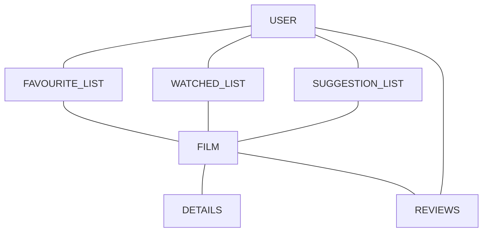
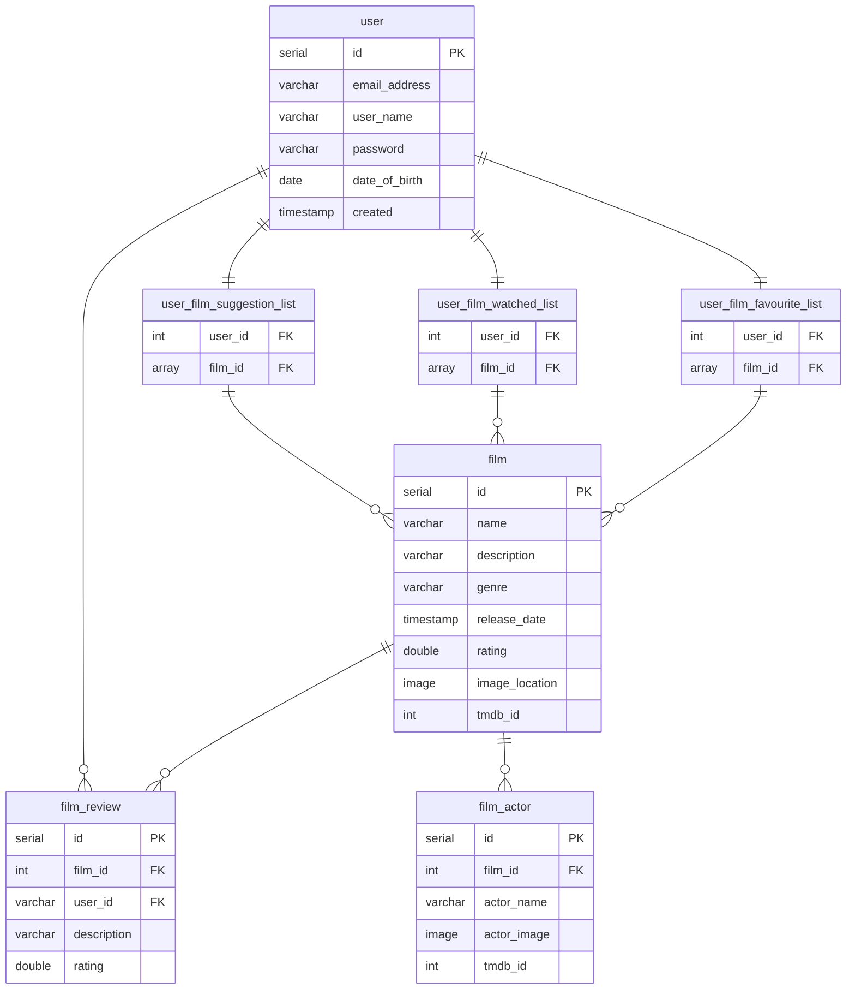

# HeresAFilm

## What is the Application?

An iOS app that will give the user a random selection of film each day based on the user's personal favourites / predefined genres.
By giving a user a selection of films, the user will be introduced to films which they may not have seen before/ a film they've forgot about.
The app will provide a synopsis + details of the film and a star rating.

## Why?

The aim is to provide the user with new entertainment content for whenever they want something to watch. Providing this app will help reduce the amount of time a user will take picking a film to watch.

## MVP

- User Creation / Login
- User Favourite Movie List
- Random Movie Suggestion List
- Movie Detail Screen
- Movie Reviews + Star Rating

## Stretch Goals

- Allow User to write reviews / rate film
- Create a watched list so user's don't see repeated suggestions
- Video Player for Movie Trailers

## Domain Model



# Entity Relationship Diagram


# API Specification

#### USERS
`GET /users`
#### Return a list of all users

```json
[
  {
    "id": 1,
    "email_address": "user@email.com",
    "user_name": "username",
    "date_of_birth": "0000-00-00"
  },
  {
    "id": 2,
    "email_address": "user@email.com",
    "user_name": "username",
    "date_of_birth": "0000-00-00"
  }
]
```
#### Response: `200 Success`
---
`GET /users/{id}`
#### Return a user

```json
  {
    "id": 1,
    "email_address": "user@email.com",
    "user_name": "username",
    "date_of_birth": "0000-00-00"
  }
```
#### Response: `200 Success`
---
`POST /users`
#### Create a user

```json
{
    "email_address": "user@email.com",
    "user_name": "username",
    "password": "password",
    "date_of_birth": "0000-00-00",
    "created": "2022-12-12 14:29:20.012024"
}
```
#### Response: `201 Created`
---
`DELETE /user/{id}`
#### Deletes User
```json 
{
}
```
#### Response: `204 No Content`
---
`GET /users/{id}/reviews`
#### Return user's reviews

```json
{
"film_id": 1,
"film_name": "FILM",
"rating": 8.5,
"description": "Great movie"
}
```
#### Response: `200 success`
---
`GET /users/films/{id}/favourites`
#### Return user's reviews

```json
[{
"film_id": 1,
"film_name": "FILM",
"rating": 8.5,
"description": "Great movie"
}]
```
#### Response: `200 success`
---
`GET /users/films/{id}/suggestions`
#### Return user's suggestion list

```json
[{
"film_id": 1,
"film_name": "FILM",
"rating": 8.5,
"synopsis": "Great movie"
}]
```
#### Response: `200 success`
---
`GET /users/films/{id}/watched`
#### Return user's watched list

```json
[{
"film_id": 1
}]
```
#### Response: `200 success`
---
`POST /users/films/{id}/favourites`
#### Creates user's favourite film list

```json
{
"film_id": [1,2,3]
}
```
#### Response: `201 Created`
---
`PUT /users/films/{id}/favourites`
#### Updates user's favourite film list

```json
{
"film_id": [1,2,3]
}
```
#### Response: `201 success`
---

#### FILMS
`PUT /films/{id}`
#### Add a film to the film table
```json
{
 "name": "film name"
 "description": "This is a movie"
 "genre": "Action"
 "release_date": "0000-00-00"
 "rating": 8.5
 "image_location": "www.google.com"
 "tmdb_id" : 1111
}
```
#### Response: `200 success`
---

`GET /films/{id}`
#### Retrieve film 
```json
{
 "name": "film name"
 "description": "This is a movie"
 "genre": "Action"
 "release_date": "0000-00-00"
 "rating": 8.5
 "image_location": "www.google.com"
 "tmdb_id" : 100
}
```
#### Response: `200 success`
---

### ACTORS
`GET /actors/{film_id}`
#### Retrieve the actors of specific film
```json 
[{
"id": 1,
"name": "Chuck Norris",
"image": "www.googleImages.com",
"tmdb_id": 500
},{
"id": 5,
"name": "Keanu Reeves",
"image": "www.googleImages.com"
"tmdb_id": 4313
}]
```
#### Response: `200 success`
---

### REVIEWS
`GET /films/{id}/reviews`
#### Retrieve the reviews of specific film
```json 
[{
"user_id": 2,
"film_name": "FILM",
"rating": 4.0,
"description": "Terrible"
},{
"user_id": 1,
"film_name": "FILM",
"rating": 8.5,
"description": "Great movie"
}]
```
#### Response: `200 success`
---

`POST /films/{id}/reviews`
#### Create a review for specific film
```json 
{
"user_id": 2,
"film_name": "FILM",
"rating": 4.0,
"description": "Terrible"
}
```
#### Response: `201 Created`
---

`DELETE /user/reviews/{id}`
#### Deletes a review for a film
```json 
{
}
```
#### Response: `204 No Content`
---
