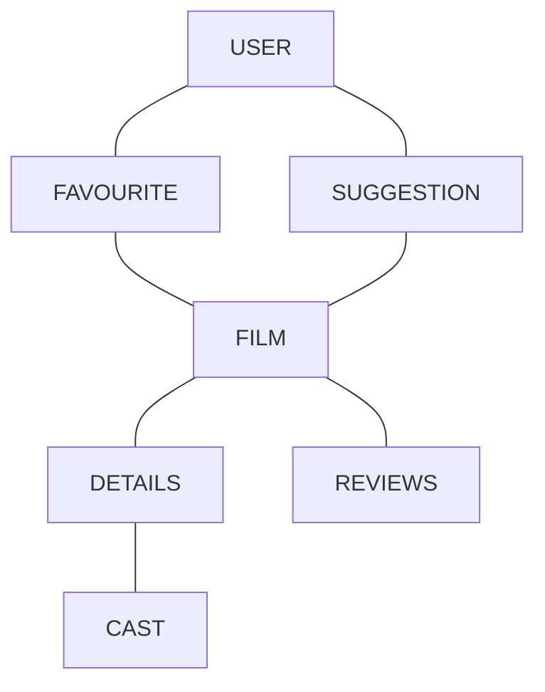
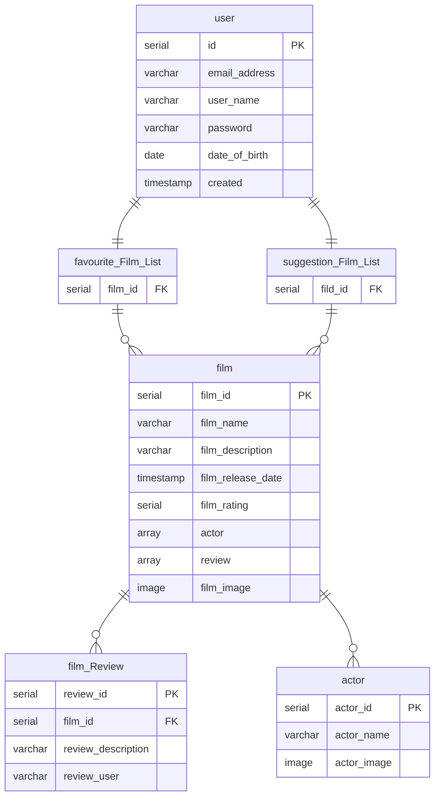

# HeresAFilm

## What is the Application?

An iOS app that will give the user a random selection of film each day based on the user's personal favourites / predefined genres.
By giving a user a selection of films, the user will be introduced to films which they may not have seen before/ a film they've forgot about.
The app will provide a synopsis + details of the film and a star rating.

## Why?

The aim is to provide the user with new entertainment content for whenever they want something to watch. Providing this app will help reduce the amount of time a user will take picking a film to watch.

## MVP

- User Creation / Login
- User Favourite Movie List
- Random Movie Suggestion List
- Movie Detail Screen
- Movie Reviews + Star Rating

## Stretch Goals

- Allow User to write reviews / rate film
- Video Player for Movie Trailers

## Domain Model

# Entity Relationship Diagram

